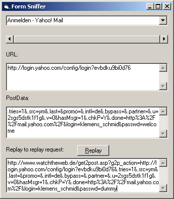



## HTML Form Sniffer \(revised\)

### Description

This VB program generates a replay URL e.g. for HTML logon pages. It is a very simple program but it makes your daily life must easier. Let's face it, how many logons do you perform very day to Web sites very day? Ok, IE's AutoComplete feature is nice but wouldn't it be nicer to logon without keying in something? This sniffer generates a URL with all the logon parameters included. When you replay it, it brings you directly to the site skipping the logon. Works also and especially for logon pages with post fields! 

For more see http://www.watchtheweb.de/tools.htm
 
### More Info
 

             |
---                |---
**Submitted On**   |2001-07-02 19:01:12
**By**             |[Klemens Schmid](https://github.com/Planet-Source-Code/PSCIndex/blob/master/ByAuthor/klemens-schmid.md)
**Level**          |Intermediate
**User Rating**    |4.5 (49 globes from 11 users)
**Compatibility**  |VB 6\.0
**Category**       |[Internet/ HTML](https://github.com/Planet-Source-Code/PSCIndex/blob/master/ByCategory/internet-html__1-34.md)
**World**          |[Visual Basic](https://github.com/Planet-Source-Code/PSCIndex/blob/master/ByWorld/visual-basic.md)
**Archive File**   |[HTML Form 22085722001\.zip](https://github.com/Planet-Source-Code/klemens-schmid-html-form-sniffer-revised__1-14681/archive/master.zip)

